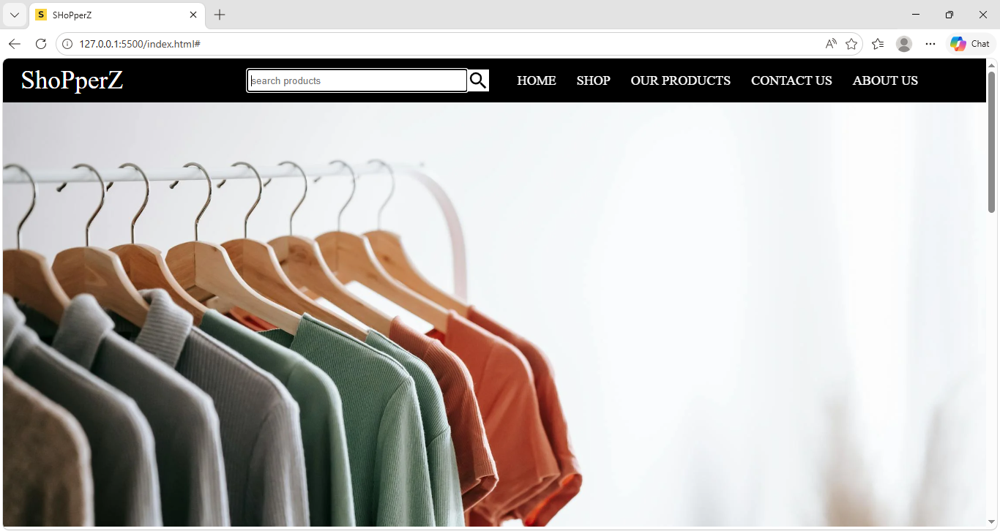

# 🛒 ShopperZ – E-Commerce Website

A responsive E-Commerce website built using **HTML, CSS, and JavaScript**.
This project includes product search, image slider, product cards, and responsive navigation menu.

---

## 🚀 Features

* Responsive Navigation Bar
* Product Search Functionality
* Image Slider / Carousel
* Product Listing Section
* Hover Effects on Products
* Responsive Design for Mobile & Laptop
* Footer with Social Links
* Favicon Added
* Clean UI Design

---

## 🛠️ Technologies Used

* HTML5
* CSS3
* JavaScript
* Ionicons (for icons)

---

## 📂 Project Structure

```
ShopperZ/
│
├── index.html
├── style.css
├── app.js
├── favicon.png
└── images/
```

---

## 🔍 How to Run the Project

1. Download or Clone the repository
2. Open the project folder in VS Code
3. Open `index.html`
4. Run using Live Server

---

## 📸 Screenshots



---

## 🌐 Future Improvements

* Add to Cart Functionality
* Login / Signup Page
* Payment Gateway
* Product Details Page
* Backend Integration

---

## 👨‍💻 Author

**Ashu Giri**

---

## 📄 License

This project is for learning purposes.
